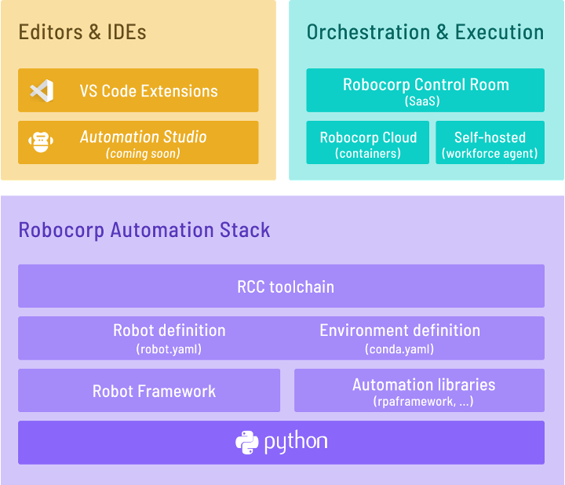

RCC is a set of tooling that allows you to create, manage, and distribute Python-based self-contained automation packages - or robots :robot: as we call them.

Together with [robot.yaml](https://robocorp.com/docs/setup/robot-yaml-format) configuration file, `rcc` is a foundation that allows anyone to build and share automation with ease.

  

## Why use rcc?

* Are developers manually installing conda or pip packages? Here rcc makes it easier for developers to just worry about getting `conda.yaml` and `robot.yaml` right, and then let rcc to do the heavy lifting of keeping environments pristine, clean, and up to date.
* Have you run into "works on my machine" problem, where the original developer has a working setup, but others have a hard time repeating the experience? In this case, let rcc help you to set up repeatable runtime environments across users and operating systems.
* Have you experienced "configuration drift", where once working runtime environment dependencies get updated and break your production system? Here rcc can help by either making drift visible or freezing all dependencies so that drifting does not happen.
* Do you have python programs that have conflicting dependencies? There rcc can help by making dedicated runtime environments for different setups, where different `robot.yaml` files define what to run and `conda.yaml` defines runtime environment dependencies

## Getting Started

:arrow_double_down: Install rcc 
> [Install](#installing-rcc-from-command-line) or [Download RCC](#direct-downloads-for-signed-executables-provided-by-robocorp)

:octocat: Pull robot from GitHub:
> `rcc pull github.com/robocorp/example-google-image-search`

:running: Run robot
> `rcc run`

:hatching_chick: Create your own robot from template
> `rcc robot initialize -t standard`

For detailed instructions, visit [Robocorp RCC documentation](https://robocorp.com/docs/product-manuals/robocorp-cli) to get started. To build `rcc` from this repository see the [Setup Guide](/docs/BUILD.md)

## Installing RCC from command line

### Windows

1. Open the command prompt
1. Download: `curl -o rcc.exe https://downloads.robocorp.com/rcc/releases/latest/windows64/rcc.exe`
1. [Add to system path](https://www.architectryan.com/2018/03/17/add-to-the-path-on-windows-10/): Open Start -> `Edit the system environment variables`
1. Test: `rcc`

### macOS

#### Brew cask from Robocorp tap

1. Install: `brew install robocorp/tools/rcc`
1. Test: `rcc`

Upgrading: `brew upgrade rcc`

#### Raw download

1. Open the terminal
1. Download: `curl -o rcc https://downloads.robocorp.com/rcc/releases/latest/macos64/rcc`
1. Make the downloaded file executable: `chmod a+x rcc`
1. Add to path: `sudo mv rcc /usr/local/bin/`
1. Test: `rcc`

### Linux

1. Open the terminal
1. Download: `curl -o rcc https://downloads.robocorp.com/rcc/releases/latest/linux64/rcc`
1. Make the downloaded file executable: `chmod a+x rcc`
1. Add to path: `sudo mv rcc /usr/local/bin/`
1. Test: `rcc`

### [Direct downloads for signed executables provided by Robocorp](https://downloads.robocorp.com/rcc/releases/index.html)

Follow above link to download site. Both tested and bleeding edge versions are available from same location.

*[EULA for pre-built distribution.](https://cdn.robocorp.com/legal/Robocorp-EULA-v1.0.pdf)*

## Documentation

Visit [https://robocorp.com/docs](https://robocorp.com/docs) to view the full documentation on the full Robocorp stack.

Changelog can be seen [here.](/docs/changelog.md) It is also visible inside rcc using command `rcc docs changelog`.

Some tips, tricks, and recipes can be found [here.](/docs/recipes.md) They are also visible inside rcc using command `rcc docs recipes`.

## Community

The Robocorp community can be found on [Developer Slack](https://robocorp-developers.slack.com), where you can ask questions, voice ideas, and share your projects.

You can also use the [Robocorp Forum](https://forum.robocorp.com)

## License

Apache 2.0
